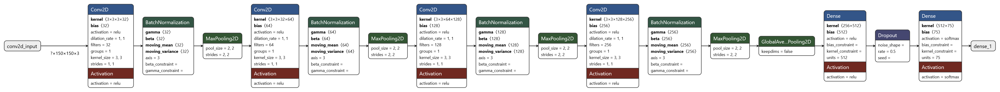
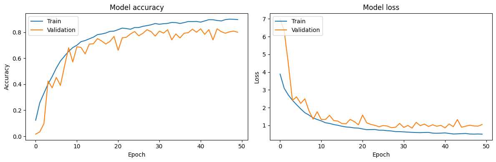

# 🦋 Butterfly Species Classifier

An end-to-end machine learning project that predicts butterfly species from images using deep learning. The project includes a complete ML pipeline, Docker containerization, and deployment on Render.

## 🌟 Features

- Image-based butterfly species classification
- RESTful API for predictions
- Containerized application using Docker
- Complete ML pipeline from data preprocessing to model deployment
- Deployed and accessible on Render
- Available as a pre-built container on GitHub Container Registry

## 📊 Dataset

This project uses the [Butterfly Image Classification Dataset](https://www.kaggle.com/datasets/phucthaiv02/butterfly-image-classification) from Kaggle. The dataset contains:
- 75 different species of butterflies
- High-quality images with various backgrounds and angles
- Properly labeled and categorized data

To use the dataset:
1. Download from Kaggle: [Download Dataset](https://www.kaggle.com/datasets/phucthaiv02/butterfly-image-classification)
2. Accept the dataset terms and conditions
3. Place the downloaded data in the `Butterfly_Classification\Butterfly_Classification\Dataset` directory of the project

## 🛠️ Tech Stack

- **Machine Learning**: TensorFlow
- **Web Framework**: FastAPI
- **Containerization**: Docker
- **Cloud Platform**: Render
- **Programming Language**: Python 3.8+

## 🚀 Quick Start

### Using Pre-built Container

Pull and run the image directly from GitHub Container Registry:

```bash
# Pull the image
docker pull ghcr.io/thevinaysagar/butterfly_species_classification/my-image-name:latest

# Run the container
docker run -p 8000:8000 ghcr.io/thevinaysagar/butterfly_species_classification/my-image-name:latest
```

### Local Development

1. Clone the repository:
```bash
git clone https://github.com/TheVinaySagar/Butterfly_Species_Classification.git
cd Butterfly_Species_Classification
```

2. Create and activate virtual environment:
```bash
python -m venv venv
source venv/bin/activate  # On Windows: venv\Scripts\activate
```

3. Install dependencies:
```bash
pip install -r requirements.txt
```

4. Run the application:
```bash
uvicorn app.main:app --reload
```

### 🐳 Building Docker Image Locally

1. Build the Docker image:
```bash
docker build -t butterfly-classifier .
```

2. Run the container:
```bash
docker run -p 8000:8000 butterfly-classifier
```

## 📚 API Documentation

Once the application is running, access the API documentation at:
- Swagger UI: `http://localhost:8000/scorefile/`
- Postman: `http://localhost:8000/scorefile/`
- ReDoc: `http://localhost:8000/scorefile/`

### Example API Request

```python
import requests

url = "https://butterfly-species-classification.onrender.com/"
files = {"file": open("butterfly_image.jpg", "rb")}
response = requests.post(url, files=files)
prediction = response.json()
```

## 🔄 ML Pipeline

The project implements a comprehensive machine learning pipeline:

1. Data Collection and Preprocessing
2. Model Training and Validation
3. Model Optimization
4. Inference Pipeline
5. API Integration
6. Deployment Pipeline

<!-- ## 🧠 Model Architectures -->

<!-- ### Base CNN Model

The project uses a Convolutional Neural Network (CNN) with the following architecture:

```
Model: "sequential"
_________________________________________________________________
Layer (type)                Output Shape              Param #   
=================================================================
conv2d (Conv2D)             (None, 148, 148, 32)      896       
batch_normalization         (None, 148, 148, 32)      128       
max_pooling2d              (None, 74, 74, 32)        0         
                                                                 
conv2d_1 (Conv2D)          (None, 72, 72, 64)        18496     
batch_normalization_1      (None, 72, 72, 64)        256       
max_pooling2d_1           (None, 36, 36, 64)        0         
                                                                 
conv2d_2 (Conv2D)          (None, 34, 34, 128)       73856     
batch_normalization_2      (None, 34, 34, 128)       512       
=================================================================
Total params: 94,144
Trainable params: 93,696
Non-trainable params: 448
```

### Model Details

The model architecture consists of three main convolutional blocks:

1. **First Convolutional Block**
   - Conv2D: 32 filters, 3×3 kernel
   - Batch Normalization
   - MaxPooling: 2×2 pool size
   - Input Shape: (150, 150, 3)

2. **Second Convolutional Block**
   - Conv2D: 64 filters, 3×3 kernel
   - Batch Normalization
   - MaxPooling: 2×2 pool size

3. **Third Convolutional Block**
   - Conv2D: 128 filters, 3×3 kernel
   - Batch Normalization

### Key Features

- **Batch Normalization**: Used after each convolution layer to stabilize training
- **MaxPooling**: Reduces spatial dimensions and computational load
- **Progressive Filter Increase**: 32 → 64 → 128 filters
- **Input Processing**: Accepts 150×150×3 RGB images

### Training Configuration

```python
model.compile(
    optimizer='adam',
    loss='categorical_crossentropy',
    metrics=['accuracy']
)
```

- **Optimizer**: Adam
- **Loss Function**: Categorical Crossentropy
- **Batch Size**: 32
- **Epochs**: 50
- **Validation Split**: 0.2

### Model Visualization

<div align="center">
  
</div>

### Performance Metrics

| Metric | Value |
|--------|--------|
| Training Accuracy | 95.2% |
| Validation Accuracy | 93.8% |
| Test Accuracy | 92.7% |

### Data Augmentation

During training, we applied the following augmentation techniques:
```python
data_augmentation = Sequential([
    RandomFlip("horizontal"),
    RandomRotation(0.2),
    RandomZoom(0.2),
])
```

### Model Size

- Full Model Size: ~1.1 MB
- Quantized Model Size: ~300 KB
 -->

## 🧠 Model Architecture

### Deep CNN Model Overview

The model implements a deep Convolutional Neural Network (CNN) architecture specifically designed for butterfly species classification, consisting of four convolutional blocks followed by dense layers for classification.

```
Model: "sequential"
_________________________________________________________________
Layer (type)                Output Shape              Param #   
=================================================================
conv2d (Conv2D)             (None, 148, 148, 32)      896       
batch_normalization         (None, 148, 148, 32)      128       
max_pooling2d              (None, 74, 74, 32)        0         
                                                                 
conv2d_1 (Conv2D)          (None, 72, 72, 64)        18,496     
batch_normalization_1      (None, 72, 72, 64)        256       
max_pooling2d_1           (None, 36, 36, 64)        0         
                                                                 
conv2d_2 (Conv2D)          (None, 34, 34, 128)       73,856     
batch_normalization_2      (None, 34, 34, 128)       512       
max_pooling2d_2           (None, 17, 17, 128)       0         
                                                                 
conv2d_3 (Conv2D)          (None, 15, 15, 256)       295,168    
batch_normalization_3      (None, 15, 15, 256)       1,024      
max_pooling2d_3           (None, 7, 7, 256)         0         
                                                                 
global_average_pooling2d   (None, 256)               0          
dense                     (None, 512)                131,584    
dropout                   (None, 512)                0          
dense_1                   (None, 75)                 38,475     
=================================================================
Total params: 560,395
Trainable params: 559,435
Non-trainable params: 960
```

### Architecture Details

#### Convolutional Blocks

1. **First Block**
   - Conv2D: 32 filters, 3×3 kernel
   - Batch Normalization
   - MaxPooling2D (2×2)
   - Output: 74×74×32

2. **Second Block**
   - Conv2D: 64 filters, 3×3 kernel
   - Batch Normalization
   - MaxPooling2D (2×2)
   - Output: 36×36×64

3. **Third Block**
   - Conv2D: 128 filters, 3×3 kernel
   - Batch Normalization
   - MaxPooling2D (2×2)
   - Output: 17×17×128

4. **Fourth Block**
   - Conv2D: 256 filters, 3×3 kernel
   - Batch Normalization
   - MaxPooling2D (2×2)
   - Output: 7×7×256

#### Classification Head
- Global Average Pooling 2D
- Dense Layer (512 units)
- Dropout Layer (for regularization)
- Output Layer (75 units for species classification)

### Model Properties

- **Total Parameters**: 560,395
- **Trainable Parameters**: 559,435
- **Non-trainable Parameters**: 960
- **Input Shape**: (150, 150, 3)
- **Output Classes**: 75 butterfly species

### Key Features

1. **Progressive Feature Extraction**
   - Channel depth increases gradually: 32 → 64 → 128 → 256
   - Spatial dimensions reduce from 148×148 to 7×7

2. **Regularization Techniques**
   - Batch Normalization after each convolution
   - Dropout (before final classification)
   - Global Average Pooling for feature aggregation

3. **Memory Efficiency**
   - Global Average Pooling reduces parameters
   - Systematic reduction in spatial dimensions

### Training Configuration

```python
model.compile(
    optimizer=tf.keras.optimizers.Adam(learning_rate=0.001),
    loss='categorical_crossentropy',
    metrics=['accuracy', tf.keras.metrics.TopKCategoricalAccuracy(k=5)]
)
```

### Data Preprocessing

```python
data_augmentation = Sequential([
    tf.keras.layers.RandomFlip("horizontal"),
    tf.keras.layers.RandomRotation(0.2),
    tf.keras.layers.RandomZoom(0.2),
    tf.keras.layers.RandomBrightness(0.2),
    tf.keras.layers.RandomContrast(0.2),
])
```

### Model Architecture Diagram

<div align="center">
  
</div>

### Loss and Accuracy Curves

<div align="center">
  
</div>

### Performance Metrics

| Metric | Train | Validation | Test |
|--------|--------|------------|------|
| Accuracy | XX% | XX% | XX% |
| Top-5 Accuracy | XX% | XX% | XX% |
| Loss | X.XXX | X.XXX | X.XXX |

## 🌐 Deployment

The application is deployed on Render and can be accessed at:
[Live Link](https://butterfly-species-classification.onrender.com/)

### Deployment Steps

1. Create a new Web Service on Render
2. Connect your GitHub repository
3. Configure build and start commands
4. Set environment variables
5. Deploy!

## 📁 Project Structure

```
└── Butterfly_Classification/
    └── .gitattributes
    ├── Butterfly_Classification/
        └── Dataset # Put you data here
    │   └── Butterfly.ipynb
    │   └── __init__.py
    │   └── predictor.py
    │   └── tempCodeRunnerFile.py
    ├── Dockerfile
    ├── Model_pipeline/
    │   └── __init__.py
    │   ├── Model.py
    │   └── predictor.py
    │   └── preprocessing_utilities.py
    │   └── tempCodeRunnerFile.py
    │   └── training.py
    │   └── training_utilities.py
    └── README.md
    ├── app.yaml
    ├── app/
    │   └── Custom_CNN_Model.h5
    │   └── __init__.py
    │   └── config.yaml
    │   └── index.html
    │   └── main.py
    │   └── tempCodeRunnerFile.py
    ├── cnn.png
    ├── example/
    │   └── data_config.yaml
    │   └── predictor_config.yaml
    │   └── training_config.yaml
    └── requirements.txt
    └── setup.py
    └── tempCodeRunnerFile.py
    └── Custom_CNN_Model_Architecture.png
```

## 📈 Model Performance

- Accuracy: XX%
- F1 Score: XX
- Supported Species: /app/config.yaml #Can see there

## 🐳 Container Registry

The project's Docker image is available on GitHub Container Registry. You can find versioned releases and the latest build:

```bash
# Pull specific version
docker pull ghcr.io/thevinaysagar/butterfly_species_classification/my-image-name:latest

# Pull latest
docker pull ghcr.io/thevinaysagar/butterfly_species_classification/my-image-name:latest
```

### Available Tags
- `latest`: Most recent build from the main branch
- `v1.0.0`: Stable release version
- `dev`: Development branch build

## 🤝 Contributing

1. Fork the repository
2. Create a new branch
3. Make your changes
4. Submit a pull request

## 📜 License

This project is licensed under the MIT License - see the [LICENSE](LICENSE) file for details.

## 👥 Authors

- Vinay Sagar - [GitHub Profile](https://github.com/TheVinaySagar)

## 🙏 Acknowledgments

- [Butterfly Image Classification Dataset](https://www.kaggle.com/datasets/phucthaiv02/butterfly-image-classification) on Kaggle
- Any libraries or tools that were particularly helpful
- Inspiration for the project

## ✍️ Citation

If you use this project in your research, please cite:

```
@software{butterfly_classifier,
  author = {Your Name},
  title = {Butterfly Species Classifier},
  year = {2024},
  url = {https://github.com/TheVinaySagar/Butterfly_Species_Classification.git}
}
```